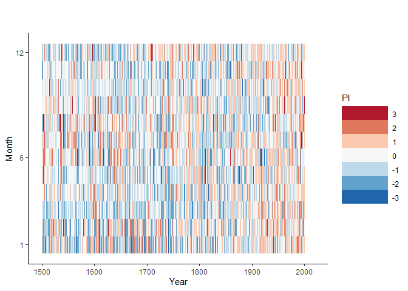

## Download Monthly Precipitatation Indices for Germany

Use tamboRapi to inq data (take some time)

Data is taken from data set: "Monthly Temperature and Hygric Indices for Central Europe since AD 1500" as provided on tambora.org.

[DOI:10.6094/tambora.org/2019/c493/csv.zip](https://doi.org/10.6094/tambora.org/2019/c493/csv.zip)
 


```r
if (!require("devtools")) install.packages("devtools")
```

```
## Loading required package: devtools
```

```r
library("devtools")
devtools::install_github('tambora-org/tamboRapi')
```

```
## Skipping install of 'tamboRapi' from a github remote, the SHA1 (75e484f5) has not changed since last install.
##   Use `force = TRUE` to force installation
```

```r
library(dplyr)
```

```
## 
## Attaching package: 'dplyr'
```

```
## The following objects are masked from 'package:stats':
## 
##     filter, lag
```

```
## The following objects are masked from 'package:base':
## 
##     intersect, setdiff, setequal, union
```

```r
## Large chunks seem to fail, so try some redundancy import

tempData0b <- tamboRapi::fromTambora("g[cid]=493&c[nd]=237&t[yb]=1500&t[ye]=1549")
```

```
## Loading required package: jsonlite
```

```
## Loading required package: httr
```

```
## Loading required package: sp
```

```
## Inquiring data from tambora.org:
## +----+----+----+----+----+----+----+----+----+----+
## ooooooooooooooooooooooooooooooooooooooooooooooooooo
## Finished
```

```r
tempData0b <- distinct(tempData0b, begin_year,begin_month_id, .keep_all= TRUE)
```

```
## Warning: The `printer` argument is deprecated as of rlang 0.3.0.
## This warning is displayed once per session.
```

```r
tempData1 <- tamboRapi::fromTambora("g[cid]=493&c[nd]=237&t[yb]=1500&t[ye]=1599")
```

```
## Inquiring data from tambora.org:
## +----+----+----+----+----+----+----+----+----+----+
## ooooooooooooooooooooooooooooooooooooooooooooooooooo
## Finished
```

```r
tempData1 <- distinct(tempData1, begin_year,begin_month_id, .keep_all= TRUE)
tempData1b <- tamboRapi::fromTambora("g[cid]=493&c[nd]=237&t[yb]=1550&t[ye]=1649")
```

```
## Inquiring data from tambora.org:
## +----+----+----+----+----+----+----+----+----+----+
## ooooooooooooooooooooooooooooooooooooooooooooooooooo
## Finished
```

```r
tempData1b <- distinct(tempData1b, begin_year,begin_month_id, .keep_all= TRUE)

tempData2 <- tamboRapi::fromTambora("g[cid]=493&c[nd]=237&t[yb]=1600&t[ye]=1699")
```

```
## Inquiring data from tambora.org:
## +----+----+----+----+----+----+----+----+----+----+
## ooooooooooooooooooooooooooooooooooooooooooooooooooo
## Finished
```

```r
tempData2 <- distinct(tempData2, begin_year,begin_month_id, .keep_all= TRUE)
tempData2b <- tamboRapi::fromTambora("g[cid]=493&c[nd]=237&t[yb]=1650&t[ye]=1749")
```

```
## Inquiring data from tambora.org:
## +----+----+----+----+----+----+----+----+----+----+
## ooooooooooooooooooooooooooooooooooooooooooooooooooo
## Finished
```

```r
tempData2b <- distinct(tempData2b, begin_year,begin_month_id, .keep_all= TRUE)

tempData3 <- tamboRapi::fromTambora("g[cid]=493&c[nd]=237&t[yb]=1700&t[ye]=1799")
```

```
## Inquiring data from tambora.org:
## +----+----+----+----+----+----+----+----+----+----+
## ooooooooooooooooooooooooooooooooooooooooooooooooooo
## Finished
```

```r
tempData3 <- distinct(tempData3, begin_year,begin_month_id, .keep_all= TRUE)
tempData3b <- tamboRapi::fromTambora("g[cid]=493&c[nd]=237&t[yb]=1750&t[ye]=1849")
```

```
## Inquiring data from tambora.org:
## +----+----+----+----+----+----+----+----+----+----+
## ooooooooooooooooooooooooooooooooooooooooooooooooooo
## Finished
```

```r
tempData3b <- distinct(tempData3b, begin_year,begin_month_id, .keep_all= TRUE)

tempData4 <- tamboRapi::fromTambora("g[cid]=493&c[nd]=237&t[yb]=1800&t[ye]=1899")
```

```
## Inquiring data from tambora.org:
## +----+----+----+----+----+----+----+----+----+----+
## ooooooooooooooooooooooooooooooooooooooooooooooooooo
## Finished
```

```r
tempData4 <- distinct(tempData4, begin_year,begin_month_id, .keep_all= TRUE)
tempData4b <- tamboRapi::fromTambora("g[cid]=493&c[nd]=237&t[yb]=1850&t[ye]=1949")
```

```
## Inquiring data from tambora.org:
## +----+----+----+----+----+----+----+----+----+----+
## ooooooooooooooooooooooooooooooooooooooooooooooooooo
## Finished
```

```r
tempData4b <- distinct(tempData4b, begin_year,begin_month_id, .keep_all= TRUE)

tempData5 <- tamboRapi::fromTambora("g[cid]=493&c[nd]=237&t[yb]=1900&t[ye]=2000")
```

```
## Inquiring data from tambora.org:
## +----+----+----+----+----+----+----+----+----+----+
## ooooooooooooooooooooooooooooooooooooooooooooooooooooo
## Finished
```

```r
tempData5 <- distinct(tempData5, begin_year,begin_month_id, .keep_all= TRUE)
tempData5b <- tamboRapi::fromTambora("g[cid]=493&c[nd]=237&t[yb]=1950&t[ye]=2000")
```

```
## Inquiring data from tambora.org:
## +----+----+----+----+----+----+----+----+----+----+
## oooooooooooooooooooooooooooooooooooooooooooooooooooooo
## Finished
```

```r
tempData5b <- distinct(tempData5b, begin_year,begin_month_id, .keep_all= TRUE)

tempData <- rbind(tempData1,tempData2,tempData3,tempData4,tempData5)
tempData <- distinct(tempData, begin_year,begin_month_id, .keep_all= TRUE)

tempDataB <- rbind(tempData0b,tempData1b,tempData2b,tempData3b,tempData4b,tempData5b)
tempDataB <- distinct(tempDataB, begin_year,begin_month_id, .keep_all= TRUE)

tempData0 <- tamboRapi::fromTambora("g[cid]=493&c[nd]=237&t[yb]=1500&t[ye]=2000")
```

```
## Inquiring data from tambora.org:
## +----+----+----+----+----+----+----+----+----+----+
## ooooooooooooooooooooooooooooooooooooooooooooooooooo
## Finished
```

```r
tempData <- rbind(tempData, tempData0)
tempData <- rbind(tempData, tempDataB)
tempData <- distinct(tempData, begin_year,begin_month_id, .keep_all= TRUE)
```

## Convert to simple time series data


```r
library(dplyr)

tempTs <-  data.frame(tempData$begin_year, tempData$begin_month_id, tempData$value_index)
names(tempTs)[names(tempTs) == "tempData.begin_year"] <- "year"
names(tempTs)[names(tempTs) == "tempData.begin_month_id"] <- "month"
names(tempTs)[names(tempTs) == "tempData.value_index"] <- "ti"
tempTs$ts <- signif(tempTs$year + (tempTs$month-0.5)/12, digits=6)
tempTs$time <- paste(tempTs$year,tempTs$month, '15 00:00:00', sep='-')

tempTs <- distinct(tempTs, year,month, .keep_all= TRUE)
tempTs <- tempTs[order(tempTs$ts),]
```

## Store as csv file


```r
write.table(tempTs, file = "csv/ti_1500_2xxx_monthly.csv", append = FALSE, quote = TRUE, sep = ",",
            eol = "\n", na = "NA", dec = ".", row.names = FALSE,
            col.names = TRUE, qmethod = "escape", fileEncoding = "UTF-8")
```

## Plot Drought time line


```r
require("ggplot2")
```

```
## Loading required package: ggplot2
```

```
## Warning: package 'ggplot2' was built under R version 3.5.3
```

```r
library("RColorBrewer")
```

```
## Warning: package 'RColorBrewer' was built under R version 3.5.2
```

```r
tempTs <- read.csv("csv/ti_1500_2xxx_monthly.csv", sep=",", na = "NA")

tempColors = rev(brewer.pal(n = 9, name = "RdBu"))

mp <- ggplot(tempTs, aes(year, month))
mp + geom_raster(aes(fill=ti))+
  #theme_classic(base_size=80) +
  theme_classic() +
  labs(x="Year", y="Month", title="", subtitle="") +
  scale_y_continuous(breaks=c(1,6,12))+
  scale_x_continuous(limits=c(1500,2020)) +  
  scale_fill_gradientn(colors=tempColors) +  
  theme( legend.key.width = unit(2,"cm")) +
  guides(fill=guide_legend(title="PI", reverse = TRUE))  
```

<!-- -->


